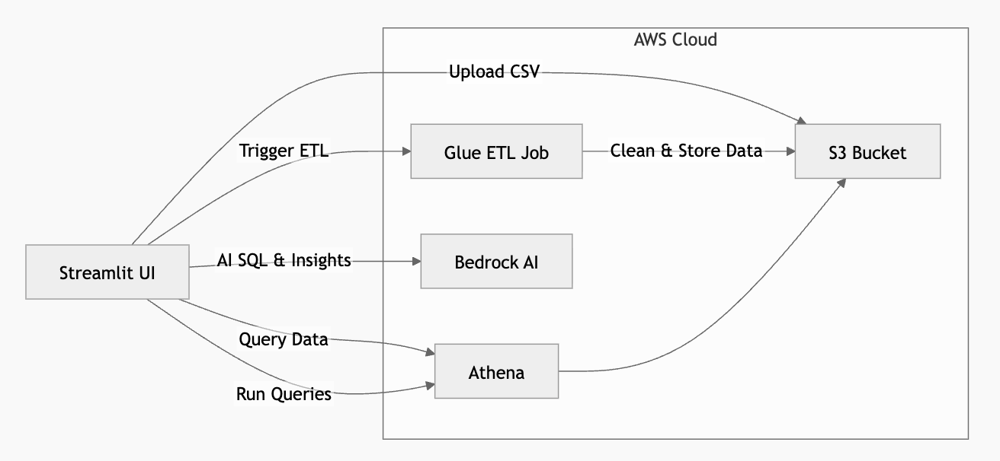

# AWS Verification & Architecture Guide: QuickMart AI Data Pipeline

This guide outlines the system architecture, component interactions, and exact verification steps on the AWS Console. Follow these steps during your demonstration to verify that the backend is fully real, serverless, and functional.

---

## 🏗️ Architecture & Service Interactions

Here is how the services in the **QuickMart Pipeline** communicate:



### End-to-End Execution Flow
1. **Pipeline Deployment (Tab 1)**: Streamlit deletes and recreates the tables in **Athena** under database `sigma_phoenix_db`, uploads the Glue Python script (`etl.py`) to S3, and uploads the baseline reference data (`customers.csv` and `products.csv`) directly to S3 processed folders.
2. **Ingestion & Processing (Tab 2)**:
   - Streamlit uploads a local daily CSV (e.g. `orders_day1.csv`) to `s3://sigma-phoenix-bucket-431294761477/raw/orders/date=YYYY-MM-DD/`.
   - It starts the **Glue Job** `sigma-phoenix-etl`, passing the date partition argument.
   - The Glue Python shell reads the raw CSV, performs data quality fixes (recovers negative amounts, deduplicates IDs, removes null customers), adds metadata columns (`processed_at`, `is_high_value`, `transaction_tier`), and writes the cleansed file to `s3://.../processed/orders/date=YYYY-MM-DD/`.
   - The Glue job writes a JSON quality report to S3.
   - Streamlit calls Athena `MSCK REPAIR TABLE` to load the new date partition.
3. **Analytics & AI Analysis (Tab 3, 4, 5)**:
   - **Athena** queries the partition-based folders in S3 on-demand.
   - **Amazon Bedrock (Nova Lite)** acts as a compiler to translate business queries into SQL, summarizes data quality warnings, and writes store manager recommendations.

---

## 🔍 Step-by-Step AWS Console Verification

Follow these steps to show your mentor that the resources exist in AWS:

### Step 1: Verify S3 Storage Layout
1. Open the [AWS S3 Console](https://s3.console.aws.amazon.com/s3/home).
2. Click on the bucket **`sigma-phoenix-bucket-431294761477`**.
3. Verify the folder structure:
   - `raw/` — Contains uploaded daily files under `orders/date=YYYY-MM-DD/`.
   - `processed/` — Contains the reference and cleansed tables:
     - `customers/customers.csv`
     - `products/products.csv`
     - `orders/date=YYYY-MM-DD/orders.csv`
   - `reports/` — Contains the JSON quality reports (e.g., `quality_report_2026-05-01.json`). Click on a JSON file and select **Actions → Open** to inspect the metric values.

> [!NOTE]
> All S3 paths map directly to Glue and Athena tables, representing a classic data lake house architectural setup.

---

### Step 2: Verify AWS Glue ETL Job
1. Navigate to the [AWS Glue Console](https://console.aws.amazon.com/glue/home).
2. Click on **Jobs** under the ETL Jobs section on the left pane.
3. Select **`sigma-phoenix-etl`**.
4. **Inspect Job Settings**:
   - Verify it is a **Python Shell** script (requires extremely low CPU overhead compared to full Spark clusters).
   - In the **Job details** tab, verify **Glue Version** is set to **`1.0`** (mandatory for Python Shell execution).
   - Under **Advanced properties**, check the key `--additional-python-modules` which is set to `pandas` to enable data frame manipulations.
5. **Inspect Run History**:
   - Go to the **Runs** tab.
   - You will see the history of executed runs, showing matching `JobRunId` strings from your Streamlit Tab 2 logs.
   - Select any successful run, click **Output logs** or **Error logs** to navigate directly to **CloudWatch Logs** where you can see the python print statements showing `Defect counts:` and `Cleaned data output:`.

---

### Step 3: Verify Athena Schema & Test Query
1. Navigate to the [Amazon Athena Console](https://console.aws.amazon.com/athena/home).
2. In the query editor, select **`sigma_phoenix_db`** from the **Database** dropdown.
3. In the left pane, expand **Tables**:
   - You will see `sigma_phoenix_orders`, `sigma_phoenix_customers`, and `sigma_phoenix_products`.
4. **Run a Test Query**:
   - Copy and paste the following SQL in a new tab:
     ```sql
     SELECT * FROM sigma_phoenix_orders LIMIT 10;
     ```
   - Click **Run**.
   - Verify that rows are successfully retrieved from your S3 processed zone and displayed in the results grid.

---

### Step 4: Verify Amazon Bedrock Model Access
1. Go to the [Amazon Bedrock Console](https://console.aws.amazon.com/bedrock/home).
2. On the left menu, scroll down and click on **Model access**.
3. Under the list of active models, verify that **Nova Lite** (`us.amazon.nova-lite-v1:0`) is enabled for requests in your region (`us-east-1`).
4. Since the Bedrock calls happen inside your python application context using the AWS SDK, checking this confirms Bedrock is authorized to generate your SQL and summarize business insights.

---

## 🛠️ CLI Alternative Verification

If you prefer to show verification via the terminal, run these commands:

```bash
# 1. Verify S3 processed orders folder
aws s3 ls s3://sigma-phoenix-bucket-431294761477/processed/orders/ --recursive

# 2. Check Glue ETL Job settings
aws glue get-job --job-name sigma-phoenix-etl

# 3. Check Glue Job Run history
aws glue get-job-runs --job-name sigma-phoenix-etl --max-items 3

# 4. Describe Athena Tables
aws athena start-query-execution --query-string "SELECT * FROM sigma_phoenix_orders LIMIT 5" --query-execution-context Database=sigma_phoenix_db --result-configuration OutputLocation=s3://sigma-phoenix-bucket-431294761477/athena-results/
```
