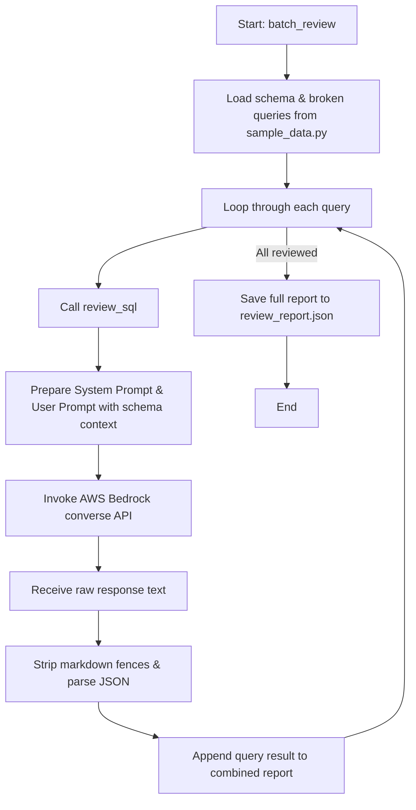

# SQL Review Agent — Technical Walkthrough

The `1_sql_review.py` script is the first module of the Day 6 **SQL Brain** layer. Its goal is to act as an automated senior data engineer, checking SQL queries for common bugs, security flaws, performance bottlenecks, and style issues before they reach production.

---

## Architecture & Flow

The script follows a sequential generation and validation workflow:



---

## Code Breakdown

### 1. Imports and Configuration
```python
import boto3
import json
from datetime import datetime
from sample_data import SCHEMA_COMPACT, BROKEN_QUERIES

bedrock = boto3.client('bedrock-runtime', region_name='us-east-1')
MODEL_ID = 'amazon.nova-lite-v1:0'
```
* **AWS SDK (`boto3`)**: Connects to the AWS Bedrock service using the `bedrock-runtime` client, targeted at the `us-east-1` region where the Nova models are hosted.
* **Model (`amazon.nova-lite-v1:0`)**: Uses Amazon Nova Lite, which provides fast, cost-effective inference for processing code analysis tasks.

### 2. The System Prompt (Structured Output)
The system prompt defines the constraints and the expected JSON output format:
```python
REVIEW_SYSTEM_PROMPT = """You are a senior Data Engineer performing a code review on SQL queries.
You review for exactly 4 categories:
1. CORRECTNESS — logic bugs (wrong results, missing filters, bad joins)
2. PERFORMANCE — anti-patterns (correlated subqueries, missing partition pruning, implicit joins)
3. SECURITY — PII exposure, SQL injection risk, overly broad access
4. READABILITY — naming, formatting, lack of comments on complex logic

For each issue found, return this EXACT JSON structure:
{
  "issues": [
    {
      "severity": "Critical|High|Medium|Low",
      "category": "Correctness|Performance|Security|Readability",
      "title": "short title",
      "line": "approximate line or clause",
      "problem": "1-2 sentence explanation",
      "fix": "corrected SQL snippet"
    }
  ],
  "corrected_sql": "the complete fixed SQL query",
  "summary": "1-2 sentence overall assessment"
}

Return ONLY valid JSON. No markdown fences. No text before or after the JSON."""
```
> [!IMPORTANT]
> The prompt forces the LLM to output a strict JSON structure without markdown fences (e.g. ` ```json `). This is essential for programmatically parsing the response in the next steps.

### 3. Review Logic (`review_sql`)
This function builds the request, invokes the LLM, and handles the output parsing:
* **Context Grounding**: The LLM is provided with the compact database schema (`SCHEMA_COMPACT`) containing the table schemas and primary/foreign key relationships.
* **Converse API**: Invokes the Bedrock `converse` API using the system prompt and user prompt.
```python
    response = bedrock.converse(
        modelId=MODEL_ID,
        system=[{"text": REVIEW_SYSTEM_PROMPT}],
        messages=[{"role": "user", "content": [{"text": user_prompt}]}],
        inferenceConfig={"maxTokens": 2000, "temperature": 0.2},
    )
```
* **Output Cleaning**: Re-formatted markdown backticks are cleaned if the LLM adds them despite instructions.
```python
    clean_text = raw_text.strip()
    if clean_text.startswith("```"):
        clean_text = clean_text.split("\n", 1)[1]
        clean_text = clean_text.rsplit("```", 1)[0]
```
* **JSON Loading**: The raw text is parsed into a Python dictionary. If parsing fails, it captures the raw string for debugging.

### 4. Batch Execution (`batch_review`)
* Iterates through the test queries defined in `sample_data.py`.
* Logs details to the console (showing issue category, severity, and suggested fixes).
* Saves the aggregated results to `review_report.json` with a timestamp:
```json
{
  "reviewed_at": "2026-05-25T06:23:13.456Z",
  "model": "amazon.nova-lite-v1:0",
  "queries": {
    "revenue_by_merchant": { ... },
    "customer_spend": { ... },
    "daily_failure_rate": { ... }
  }
}
```
