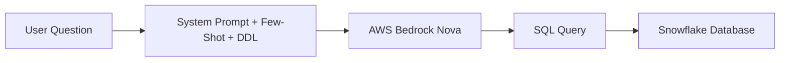
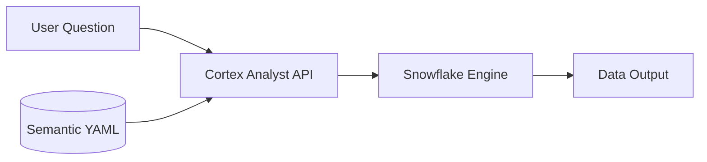

# Snowflake Cortex Analyst Lab Explained
**Day 6 · Bonus Lab · GenAI for Data Engineering**

This document provides a comprehensive explanation of the Snowflake Cortex Analyst Lab, detailing how it compares to building an NL2SQL pipeline from scratch, the design of the semantic model, integration architecture, and how to complete the lab.

---

## 💡 Overview & Objective

In the earlier parts of Day 6 (Module 2), you built a **custom NL2SQL pipeline** from scratch using Python, AWS Bedrock Nova, few-shot prompts, custom validation logic, and query executors. While functional, that custom pipeline has several production limitations:
1. **Manual Prompt Overhead**: Any changes to tables, columns, or rules require editing hardcoded Python prompts.
2. **Context Limits**: A large database with hundreds of tables cannot fit into a single model prompt.
3. **Hallucination Risk**: Standard LLMs can hallucinate table or column names not present in the database.
4. **Data Residency**: Data or schema details must be sent out to external APIs (like AWS Bedrock).

**Cortex Analyst** is Snowflake's native, managed NL2SQL engine. Instead of writing code and prompts, you describe your data schema, joins, business calculations, and verified examples in a structured **Semantic Model YAML file**. Snowflake manages the underlying model, prompt engineering, security boundaries, and execution.

---

## 🏗️ Architectural Comparison

### Custom NL2SQL Pipeline (Module 2)

* **Your Responsibility**: Maintain the Python pipeline, update DDL schema prompts, format few-shot examples, and validate the SQL output to prevent destructive queries.

### Cortex Analyst Pipeline (Bonus Lab)

* **Your Responsibility**: Write and maintain a single **Semantic Model YAML file** and store it in a Snowflake stage. Snowflake handles the query validation, safety limits, model context, and execution internally.

---

## 📝 Semantic Model YAML Structure

The semantic model YAML is the core configuration. It acts as the "source of truth" and contains four main sections:

### 1. `tables` (Metadata & Grounding)
Describes every table, column, data type, and detailed description. This helps the engine understand what columns mean and provides sample values for categories or statuses.
* **Example**: Describing `FACT_TRANSACTIONS.AMOUNT` explicitly states it records *attempted* amounts (including failed ones) and is not the same as revenue.

### 2. `relationships` (Join Paths)
Declares many-to-one or one-to-many join paths between tables so Cortex knows exactly how to join tables (e.g., joining `FACT_TRANSACTIONS` to `DIM_MERCHANT` on `MERCHANT_ID`). This removes the need for the model to guess join keys.

### 3. `metrics` (Calculated Measures)
Defines complex calculations at the database level so the LLM doesn't attempt to compute them on the fly.
* **Example**:
  ```yaml
  metrics:
    - name: total_revenue
      expr: "SUM(CASE WHEN FACT_TRANSACTIONS.STATUS = 'COMPLETED' THEN FACT_TRANSACTIONS.AMOUNT ELSE 0 END)"
  ```

### 4. `verified_queries` (Few-Shot Examples)
Question-to-SQL pairs verified by data engineers. If a user's question is close to one of these, Cortex uses it as a high-confidence template to construct the query.

---

## 🐍 Client Integration

The lab guides you to build `cortex_analyst.py` which connects to Snowflake using key-pair authentication.
The Python code utilizes Snowflake's native Cortex complete functionality:
```python
cur.execute("SELECT SNOWFLAKE.CORTEX.COMPLETE('mistral-large2', %s)", (prompt,))
```
This is used to ground the NL2SQL generation on the uploaded YAML file (`@SIGMA_DE.PUBLIC.SEMANTIC_MODELS/sigma_semantic_model.yaml`), fetch the SQL, execute it against the database, and return results.

---

## ⚖️ Evaluation & Head-to-Head Comparison

The milestone comparison asks you to evaluate both approaches across five key metrics:
1. **Setup Effort**: Custom code vs. standard YAML specification.
2. **Maintenance**: Rewriting prompts vs. updating semantic models.
3. **Accuracy**: Checking if the complex business logic (like revenue filtering on `STATUS = 'COMPLETED'`) is correctly preserved.
4. **Data Residency**: Keeping all query execution metadata within Snowflake’s trust boundary vs. sending schema DDL to external LLMs.
5. **Cost**: AWS Bedrock token pricing vs. Snowflake warehouse credit consumption.

---

## 🚀 Stretch Goal: Multi-Turn Conversation
In production self-serve dashboards, users ask follow-up questions (e.g., *"Which merchant had the highest revenue?"* followed by *"How many of their transactions failed?"*). The stretch goal demonstrates maintaining conversation state by appending user questions and assistant responses into a list of messages passed to the Cortex Analyst REST API.
