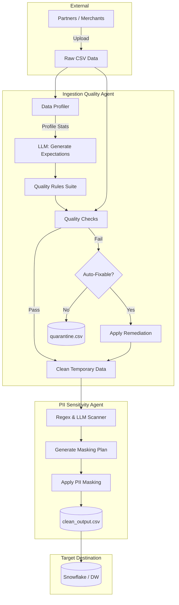
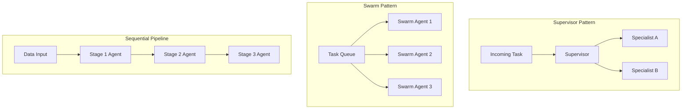
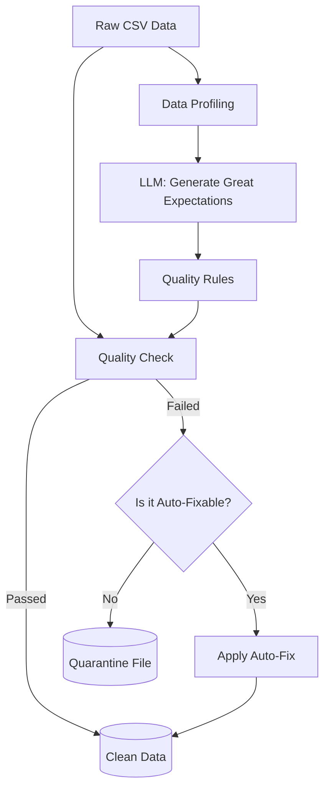
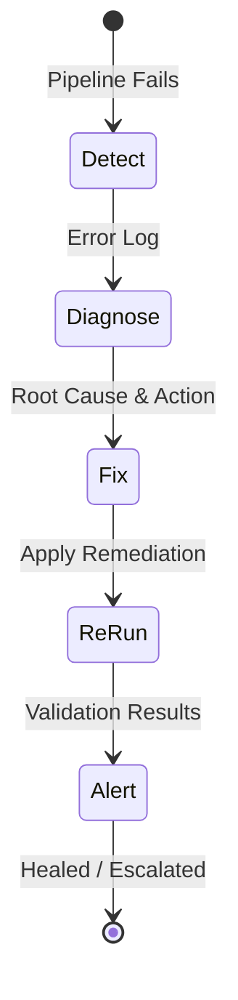

# Day 11: AI Agents for Intelligent Data Ingestion & Quality

This document provides a complete step-by-step guide for implementing the Day 11 labs. It covers the core concepts, implementation steps, commands (CMS), and verification methods for building the entry gate of the Sigma Intelligence Platform.

---

## 1. Core Concepts Explanation

The Day 11 labs focus on building autonomous agents that handle data ingestion, quality checks, PII detection, and self-healing. Here are the core concepts explored across the scripts:

### End-to-End Data Flow
This diagram illustrates the journey of raw data through the Sigma DataTech pipeline, from initial ingestion to the final load decision.



### Multi-Agent Architectures
As systems grow, a single agent becomes a bottleneck. We use three multi-agent patterns:
- **Supervisor Pattern:** A central orchestrator agent evaluates an incoming task (e.g., a new CSV file) and routes it to the most appropriate specialist agent (e.g., ProfilerAgent or QualityAgent). Best for dynamic task routing.
- **Swarm Pattern:** A decentralized approach where peer agents pull tasks from a shared queue. Best for high-volume, parallel processing (e.g., processing millions of rows in batches).
- **Sequential Pipeline:** An assembly line approach where the output of one agent becomes the input for the next (e.g., Profiling → Validation → Load Decision). Best for dependent transformations.



### Automated Data Profiling & Great Expectations
Instead of manually inspecting schemas, the **Ingestion Quality Agent** automatically profiles unknown datasets (detecting nulls, types, negative counts). It then sends this profile to an LLM (Bedrock Nova Pro) to dynamically generate **Great Expectations** rules (e.g., `expect_column_values_to_not_be_null`), ensuring strict data quality rules are created without human intervention.

### Auto-Remediation vs. Quarantining
When data fails quality checks, the agent must decide how to handle it:
- **Auto-Fix:** Safe, deterministic fixes (e.g., filling null amounts with the median, marking invalid date strings, stripping whitespace).
- **Quarantine:** Unresolvable or critical failures (e.g., missing primary keys) are segregated into a `quarantine.csv` file, ensuring bad data never reaches production while preserving an audit trail.



### PII Detection & Data Sensitivity
Data privacy is enforced by the **PII Sensitivity Agent** before data is loaded:
- **Regex-Based Detection:** Fast, high-confidence detection for structured PII like PAN, Aadhaar, Phone Numbers, and Emails.
- **LLM-Assisted Detection:** Used for ambiguous column names (e.g., `emp_nm`, `dob_dt`) that bypass regex scanners.
- **Data Sensitivity Tiers:** Datasets are classified (Public, Internal, Confidential, Restricted) to determine masking strategies and load restrictions.

### Self-Healing Loops
To minimize on-call alerts, pipelines should attempt to fix themselves. The loop consists of:
1. **Detect:** Monitor for failure signals (e.g., null primary key errors).
2. **Diagnose:** An LLM classifies the root cause and recommends a fix.
3. **Fix:** Apply safe, automated remediation (e.g., dropping bad rows or filling nulls).
4. **Re-Run:** Validate if the fix resolved the issue.
5. **Alert:** Generate an incident report for auditing, escalating to a human only if auto-healing fails.



---

## 2. Implementation Steps & Commands (CMS)

Follow these steps sequentially to implement and run the Day 11 labs.

### Step 0: Pre-Work & Setup
Before running the scripts, you must set up the environment and complete the manual annotation exercise.

**Commands:**
```bash
# 1. Install dependencies
pip install -r lab/requirements.txt

# 2. Complete the manual annotation exercise
# Open `lab/manual_first_exercise.csv`, fill the 3 blank columns (issue_found, severity, auto_fixable), and save as `lab/manual_first_annotated.csv`.

# 3. Commit and push pre-work
git add lab/manual_first_annotated.csv
git commit -m "Day 11 pre-work — manual first exercise"
git push
```

### Step 1: Generate Sample Data
Generate the foundational datasets used by the agents.
**Command:**
```bash
python lab/sample_data.py
```
*Output:* Creates `transactions_raw.csv` and `customers_raw.csv` in the `data/` directory.

### Step 2: Run the Multi-Agent Pipeline (Lab 1)
Run the script to see the Supervisor, Swarm, and Sequential agent patterns in action.
**Command:**
```bash
python lab/1_multi_agent_pipeline.py
```
*Outputs:* `supervisor_result.json`, `swarm_result.json`, `pipeline_result.json` in `agent_outputs/`.
*(Note: You will be prompted to answer a Judgment Question in the terminal).*

### Step 3: Run the Ingestion Quality Agent (Lab 2)
Execute the main lab script, which profiles the data, generates Great Expectations rules, and quarantines bad rows.
**Command:**
```bash
python lab/2_ingestion_quality_agent.py
```
*Outputs:* `quality_report.json`, `ge_expectations.json`, `clean_output.csv`, `quarantine.csv`.
*(Note: You will be prompted to answer a Judgment Question in the terminal).*

### Step 4: Run the PII Sensitivity Agent (Lab 3)
Execute the script to perform regex and LLM-based PII scans.
**Command:**
```bash
python lab/3_pii_sensitivity_agent.py
```
*Outputs:* `pii_scan_report.json`, `sensitivity_report.json`.
*(Note: You will be prompted to answer a Judgment Question in the terminal).*

### Step 5: Stretch Goal - Self-Heal Loop (Lab 4)
This script requires manual coding to implement the `cast_column_type` fix.
**Command:**
```bash
python lab/4_stretch_goal_self_heal_loop.py
```
*Output:* `self_heal_incident_report.json`.

---

## 3. Verifications

To verify that your implementation is correct and complete, run the provided validation script. This ensures all JSON reports and CSV outputs exist and meet the lab criteria.

**Command:**
```bash
python tests/validate_day11.py
```
**Expected Results:**
- ✅ Green checkmarks indicate core labs are successfully completed.
- 👑 A Crown indicates the stretch goal (Lab 4) was successfully implemented.

---

## 4. Stretch Goal Instructions (TODO)

To fully complete the day and earn the crown validation, you must edit `lab/4_stretch_goal_self_heal_loop.py`:
1. Find the `apply_fix()` function.
2. Locate the `elif action == "cast_column_type":` block.
3. Implement the logic to fix the `type_mismatch` error (`INC-003`). 
   - *Hint:* Load the CSV (`failure.get("dataset")`), convert the `amount` column to numeric using `pd.to_numeric(..., errors='coerce')`, fill NaNs with `0` or the median, and save it to the output directory as `fixed_transactions_raw.csv`.

Once everything passes, push your work:
```bash
git add .
git commit -m "Day 11 complete"
git push
```
